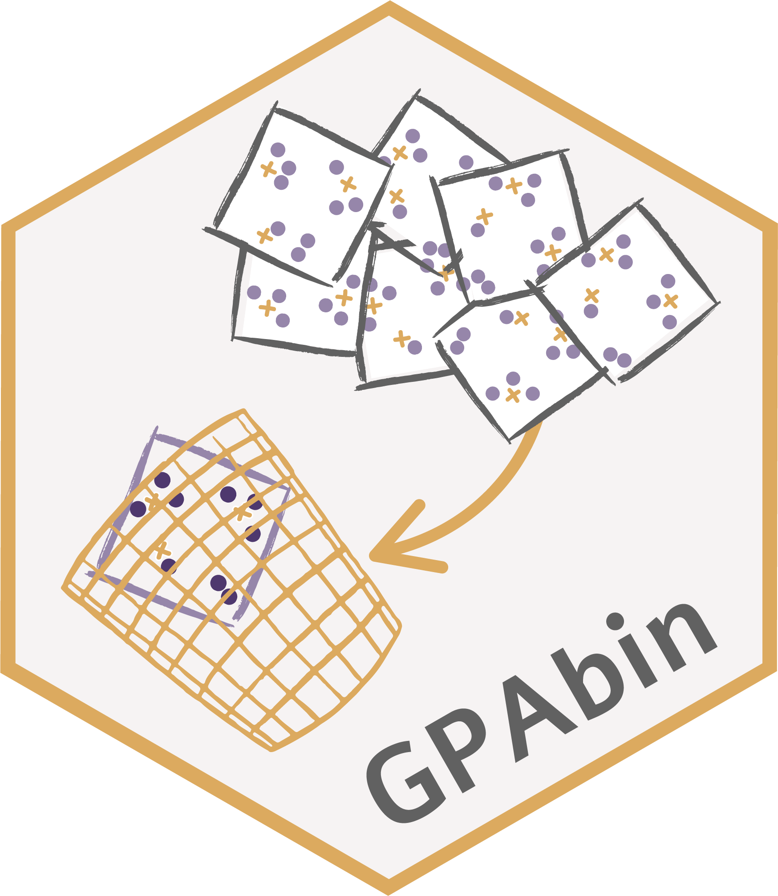

<!-- README.md is generated from README.Rmd. Please edit that file -->

# GPAbin 

`GPAbin` biplots to unify visualisations from multiple imputed data.

## Installation

You can install the development version of GPAbin from
[GitHub](https://github.com/) with:

``` r
# install.packages("pak")
pak::pak("jnienk/GPAbin")
```

## About the name

Generalised orthogonal Procrustes analysis (**GPA**) is used to align
individual biplots before combining their separate coordinate sets into
an average coordinate matrix, to mimic Ru**bin**’s rules. Finally, this
average coordinate matrix is then utilized to construct a single biplot
called a GPAbin biplot.
